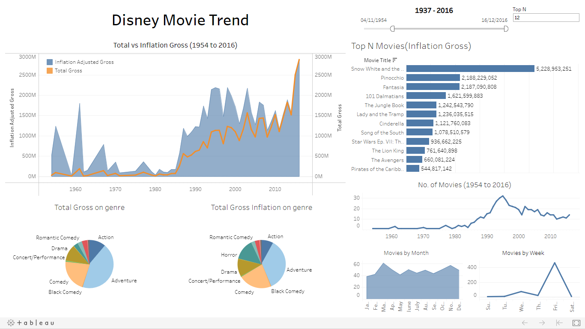

# Onyx Data Visualization Challenges

BI Visualizations to the problems in website

## Disney Movies 1937 – 2016 Gross Income(May)

[DashBoard Link](https://public.tableau.com/profile/anurag.peddi#!/vizhome/OnyxMayChallenge/DisneyMovies)

Walt Disney Studios is the foundation on which The Walt Disney Company was built. The Studios has produced more than 600 films since it's debut film, Snow White and the Seven Dwarfs in 1937. While many of its films were big hits, some of them were not. This dataset contains all the movies from 1937 to 2016 that were released by Disney. The data contains 579 Disney movies with six following attributes:

* Movie Title
* Release Date
* Genre
* MPAA Rating
* Total Gross
* Inflation Adjusted Gross

### Inspiration

Some of the interesting questions (tasks) which can be performed on this dataset –

1. Understanding what contributes to success of Disney movies
2. Identifying gross rate from release date
3. Analysis of Disney movie releases per year over time
4. Which category is the most profitable for Disney and do they focus on that category
